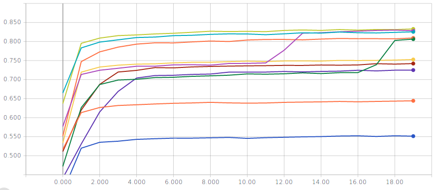
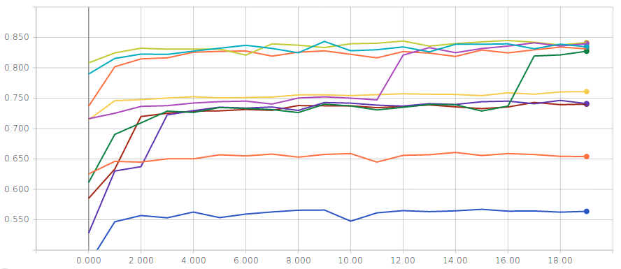
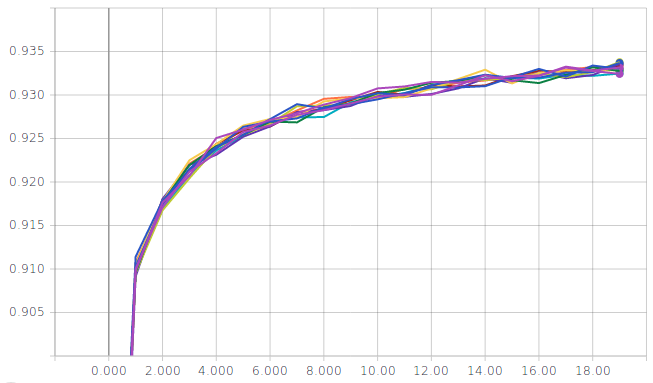
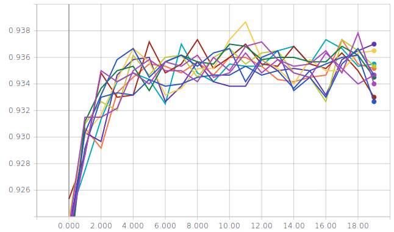
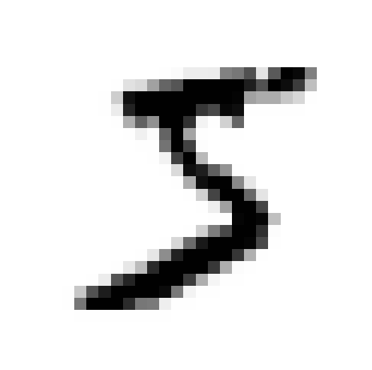
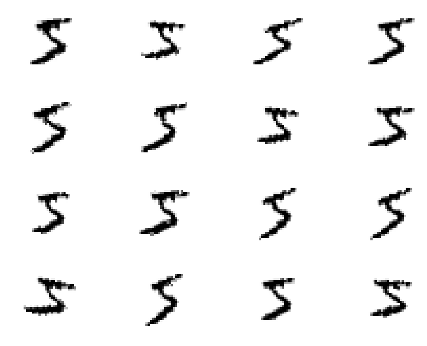

---
title:  'First steps in Keras: classifying handwritten digits(MNIST)'
author:
- Jeremy Fix
keywords: [Keras tutorial, MNIST]
...

Objectives
----------

In this practical, we will make our first steps with Keras and train our
first models for classifying the handwritten digits of the MNIST
dataset. It should be noted that this dataset is no more considered as a
challenging problem but for an introduction with Keras and the first
trained architectures, it does the job.

The models you will train are :

-   a linear classifier
-   a fully connected neural network with two hidden layers
-   a vanilla convolutional neural network (i.e. a LeNet like convnet)
-   some fancier architectures (e.g. ConvNets without fully connected layers)

The point here is to introduce the various syntactic elements of Keras
to:

-   load the datasets,
-   define the architecture, loss, optimizer,
-   save/load a model and evaluate its performances
-   monitor the training progress by interfacing with tensorboard

A Linear classifier
-------------------

Before training deep neural networks, it is good to get an idea of the
performances of a simple linear classifier. So we will define and train
a linear classifier and see together how this is written in
Python/Keras.

**Important**: Below, we see together step by step how to set up our
training script. While reading the following lines, edit a file named
**train\_mnist\_linear.py** that you will fill. We also see the modules
to be imported only when these are required but obviously, it is clearer
to put these imports at the beginning of your scripts. So the following
python codes should not be strictly copy-pasted on the fly.

### Loading and basic preprocessing the dataset

The first step is to load the dataset as numpy arrays. Functions are
already provided by Keras to [import some
datasets](https://keras.io/datasets/). The MNIST dataset is made of gray
scale images, of size 28 \\times 28, with values in the range
\[0; 255\]. The training set consists in 60000 images and the test set
consists in 10000 images. Every image represents an handwritten digit in
\[0, 9\]. Below, we show the 10 first samples of the training set.

{.bordered}

To import the MNIST dataset in Keras, you can do the following:

``` {.python .numberLines}
from keras.datasets import mnist
from keras.utils import to_categorical

(X_train, y_train), (X_test, y_test) = mnist.load_data()
```

X\_train and y\_train are numpy arrays of respective shape
(60000, 28, 28) and (60000,). X\_test and y\_test are numpy arrays of
respective shape (10000, 28, 28) and (10000, ). X\_train and X\_test
contain the images and y\_train and y\_test contain the labels. For a
linear classifier (or in fact Dense Layers as well as we shall see in a
moment and this is different from convolutional layers we will see later
on) expect to get vectors in their input and not images, i.e.
1-dimensional and not 2-dimensional objects. So we need to reshape the
loaded numpy arrays

``` {.sourceCode .python}
num_train  = X_train.shape[0]
num_test   = X_test.shape[0]

img_height = X_train.shape[1]
img_width  = X_train.shape[2]
X_train = X_train.reshape((num_train, img_width * img_height))
X_test  = X_test.reshape((num_test, img_width * img_height))
```

Now, the shape of X\_train and X\_test are (60000, 784) and (10000, 784)
respectively.

The networks we are going to train output, for each input image, a
probability distribution over the labels. We therefore need to convert
the labels into their one-hot encoding. Keras provides the
to\_categorical function to do that.

``` {.sourceCode .python}
y_train = to_categorical(y_train, num_classes=10)
y_test = to_categorical(y_test, num_classes=10)
```

Now, the shape of y\_train and y\_test is (60000, 10) and (10000, 10)
respectively and the first 10 entries of y\_train are:

``` {.sourceCode .python}
[ 0.  0.  0.  0.  0.  1.  0.  0.  0.  0.]
[ 1.  0.  0.  0.  0.  0.  0.  0.  0.  0.]
[ 0.  0.  0.  0.  1.  0.  0.  0.  0.  0.]
[ 0.  1.  0.  0.  0.  0.  0.  0.  0.  0.]
[ 0.  0.  0.  0.  0.  0.  0.  0.  0.  1.]
[ 0.  0.  1.  0.  0.  0.  0.  0.  0.  0.]
[ 0.  1.  0.  0.  0.  0.  0.  0.  0.  0.]
[ 0.  0.  0.  1.  0.  0.  0.  0.  0.  0.]
[ 0.  1.  0.  0.  0.  0.  0.  0.  0.  0.]
[ 0.  0.  0.  0.  1.  0.  0.  0.  0.  0.]
```

For now, this is all we do for loading the dataset. Preprocessing the
input actually influences the performances of the training but we come
back to this later when normalizing the input.

### Building the network

We consider a linear classifier, i.e. we perform logistic regression. As
a reminder, in logistic regression, given an input image $x_i \in \mathbb{R}^{28\times 28}$, we compute scores for each class
as $w_k^T x_i$ (in this notation, the input is supposed to be extended
with a constant dimension equal to 1 to take into account the bias),
that we pass through the softmax transfer function to get probabilities
over the classes :

$$P(y=k / x_i) = \frac{e^{w_k^T x_i}}{\sum_{j=0}^{9} e^{w_j^T x_i}}$$

To define this [model](https://keras.io/models/model/) with Keras, we
need an Input layer, a [Dense
layer](https://keras.io/layers/core/#dense) and an [Activation
layer](https://keras.io/layers/core/#activation)

> **Note**
>
> In keras, a model can be specified with the
> [Sequential](https://keras.io/models/sequential/) or
> [Functional](https://keras.io/models/model/) API. We here make use of
> the functional API which is more flexible than the Sequential API.
> Also, while one could incorporate the activation within the dense
> layers, we will be using linear dense layers so that we can visualize
> what is going on after each operation.

In Python, this can be written as :

``` {.sourceCode .python}
from keras.layers import Input, Dense, Activation
from keras.models import Model

num_classes = 10
xi      = Input(shape=(img_height*img_width,))
xo      = Dense(num_classes)(xi)
yo      = Activation('softmax')(xo)
model   = Model(inputs=[xi], outputs=[yo])

model.summary()
```

In the input layer, we just specify the dimension of a single sample,
here 784 pixels per image. The dense layer has num_classes=10 units.
The output of the dense layer feeds the softmax transfer function. By
default, in Keras, a dense layer is linear and has the bias so that we
do not need to extend the input to include the constant dimension.
Therefore the outputs of yo are all in the range [0, 1] and sum up to
1. Finally, we define our model specifying the input and output layers.
The call to model.summary() will display a summary of the architecture
in the terminal.

### Compiling and training

The next step is, in the terminology of Keras, to
[compile](https://keras.io/models/model/#compile) the model by providing
the loss function to be minimized, the optimizer and the metrics to
monitor. For this classification problem, an appropriate loss is the
crossentropy loss. In Keras, among all the
[Losses](https://keras.io/losses/), we will use the
**categorical\_crossentropy** loss. For the optimizer, several
[Optimizers](https://keras.io/optimizers/) are available and we will use
**adam**. For the metrics, you can use some [predefined
metrics](https://keras.io/metrics/) or define your own. Here, we will
use the **accuracy** which makes sense because the dataset is balanced.

In Python, this can be written as

``` {.sourceCode .python}
model.compile(loss='categorical_crossentropy', 
              optimizer='adam',  
              metrics=['accuracy'])
```

> **Note**
>
> Metrics, losses and optimizers can be specified in two ways in the
> call of the compile function. It can be either specified by a string
> or by passing a function for the loss, a list of functions for the
> metrics and an Optimizer object for the optimizer.

We are now ready for training our linear classifier, by calling the [fit
function](https://keras.io/models/model/#fit).

``` {.sourceCode .python}
model.fit(X_train, y_train,
          batch_size=128,
          epochs=20,
          verbose=1,
          validation_split=0.1)

score = model.evaluate(X_test, y_test, verbose=0)
print('Test loss:', score[0])
print('Test accuracy:', score[1])
```

We here used $10 \%$ of the training set for validation purpose. This is
based on the validation loss that we should select our best model (why
should we do it on the validation loss rather than the validation
accuracy?). At the end, we evaluate the performances on the test set.

You are now ready for executing your first training. You need first to
log on a GPU node as described in section
Using the GPU cluster of CentraleSupelec\_

``` console
# First you log to the cluster
...
# And then :
python3 train_mnist_linear.py
```

This is your first trained classifier with Keras. Depending on how lucky
you are, you may reach a Test accuracy of something between $50\%$ and
$85\%$ . If you repeat the experiment, you should end up with various
accuracy; The training does not appear to be very consistent.

### Callbacks for saving the best model and monitoring the training

So far, we just get some information within the terminal but Keras
allows you to define [Callbacks](https://keras.io/callbacks/). We will
define two callbacks :

- a [TensorBoard](https://keras.io/callbacks/#tensorboard) callback
    which allows to monitor the training progress with tensorboard
- a [ModelCheckpoint](https://keras.io/callbacks/#modelcheckpoint)
    callback which saves the best model with respect to a provided
    metric

For both these callbacks, we need to specify a path to which data will
be logged. I propose you the following utilitary function which
generates a unique path:

``` {.sourceCode .python}
import os
...
def generate_unique_logpath(logdir, raw_run_name):
    i = 0
    while(True):
        run_name = raw_run_name + "-" + str(i)
        log_path = os.path.join(logdir, run_name)
        if not os.path.isdir(log_path):
            return log_path
        i = i + 1
```

For defining a TensorBoard callback, you need to add its import,
instanciate it by specifying a directory in which the callback will log
the progress and then modify the call to fit to specify the callback.

``` {.sourceCode .python}
from keras.callbacks import TensorBoard
...
run_name = "linear"
logpath = generate_unique_logpath("./logs_linear", run_name)
tbcb = TensorBoard(log_dir=logpath)
...
model.fit(X_train, y_train,
          batch_size=128,
      epochs=20,
      verbose=1,
      validation_split=0.1,
      callbacks=[tbcb])
```

Once this is done, you have to start tensorboard on the GPU and run
[port_forward.sh](data/scripts/port_forward.sh) (or [port_forward_host.sh](data/scripts/port_forward_host.sh) for SM20 life long training sessions) to get locally access to the remote tensorboard.

``` console
[In one terminal on the GPU]
sh11:~:mylogin$ tensorboard --logdir ./logs_linear
Starting TensorBoard b'47' at http://0.0.0.0:6006
(Press CTRL+C to quit)

[In a terminal local to your machine]
mymachine:~:mylogin$ ./port_forward.sh ....... -p 6006
```

And then start a browser and log to <http://localhost:6006> . Once this
is done, you will be able to monitor your metrics in the browser while
the training are running.

The second callback we define is a ModelCheckpoint callback which will
save the best model based on a provided metric, e.g. the validation
loss.

``` {.sourceCode .python}
from keras.callbacks import ModelCheckpoint
...
run_name = "linear"
logpath = generate_unique_logpath("./logs_linear", run_name)
checkpoint_filepath = os.path.join(logpath,  "best_model.h5")
checkpoint_cb = ModelCheckpoint(checkpoint_filepath, save_best_only=True)
model.fit(X_train, y_train,
          batch_size=128,
      epochs=20,
      verbose=1,
      validation_split=0.1,
      callbacks=[tbcb, checkpoint_cb])
```

You can now run several experiments, monitor them and get a copy of the
best models. A handy bash command to run several experiments is given
below :

``` console
for iter in $(seq 1 10); do \
echo ">>>> Run $iter" && python3 train_mnist_linear.py ; done;
```

> **Logistic regression without normalization of the input**
>
> Two metrics are displayed for several runs; on the left the training
> accuracy and on the right the validation accuracy
>
> {width="45%"}
> {width="45%"}

You should reach a validation and test accuracy between $55\%$ and $85\%$.
The curves above seem to suggest that there might be several local
minima...but do not be misleaded, the optimization problem is convex so
the results above are just indications that we are not solving our
optimization problem the right way.

### Loading a model

In the previous paragraph, we regularly saved the best model (with the
ModelCheckpoint callback) with respect to the validation loss. You may
want to load this best model, for example for estimating its test set
performance at the end of your training script.

At the time of writing this practical, there is [an issue in the "h5"
file saved by Keras](https://github.com/fchollet/keras/issues/4044) and
some of its elements must be removed in order to be able to reload the
model :

``` {.sourceCode .python}
import h5py
from keras.models import load_model
...
with h5py.File(checkpoint_filepath, 'a') as f:
    if 'optimizer_weights' in f.keys():
        del f['optimizer_weights']

model = load_model(checkpoint_filepath)
score = model.evaluate(X_test, y_test, verbose=0)
print('Test loss:', score[0])
print('Test accuracy:', score[1])
```

### Normalizing the input

So far, we used the raw data, i.e. images with pixels in the range
[0, 255]. It is usually a good idea to normalize the input because it
allows to make training faster (because the loss becomes more circular
symmetric) and also allows to use a consistent learning rate for all the
parameters in the architecture.

There are various ways to normalize the data and various ways to
translate it into Keras. The point of normalization is to equalize the
relative importance of the dimensions of the input. One normalization is
**min-max scaling** just scaling the input by a constant factor, e.g.
given an image I, you feed the network with $\frac{I}{255.} - 0.5$. Another
normalization is standardization. Here, you compute the mean of the
**training vectors** and their variance and normalize every input vector
(even the test set) with these data. Given a set of training images
$X_i \in \mathbb{R}^{784}, i \in [0, N-1]$, and a vector $X \in \mathbb{R}^{784}$ you feed the network with $\hat{X} \in \mathbb{R}^{784}$ given by

$$
X_\mu = \frac{1}{N} \sum_{i=0}^{N-1} X_i$$$$X_\sigma = \sqrt{\frac{1}{N} \sum_{i=0}^{N-1} (X_i - X_\mu)^T (X_i - X_\mu)} + 1.0$$$$\hat{X} = (X - X_\mu)/X_\sigma
$$

How do we introduce normalization in a Keras model ? One way is to
create a dataset that is normalized and use this dataset for training
and testing. Another possibility is to embed normalization in the
network by introducing a [Lambda
layer](https://keras.io/layers/core/#lambda) right after the Input
layer. For example, introducing standardization in our linear model
could be done the following way :

``` {.sourceCode .python}
from keras.layers import Lambda
...
xi = Input(shape=(img_height*img_width,), name="input")

mean = X_train.mean(axis=0)
std = X_train.std(axis=0) + 1.0
xl = Lambda(lambda image, mu, std: (image - mu) / std,
           arguments={'mu': mean, 'std': std})(xi)
xo = Dense(num_classes, name="y")(xi)
yo = Activation('softmax', name="y_act")(xo)
model = Model(inputs=[xi], outputs=[yo])
```

> **Logistic regression with input standardization**
>
> Two metrics are displayed for several runs; on the left the training
> accuracy and on the right the validation accuracy
>
>{width=45%}
>{width=45%}

You should reach a validation accuracy of around $93.6\%$ and a test
accuracy of around $92.4\%$.

## A Fully connected 2 hidden layers classifier

### Basics

Let us change the network to build a 2 hidden layers perceptron. This is
simply about adding dense layers with appropriate activations in between
the input and the output layer. Basically, the only thing you need to
change compared to the linear model is when you build up the model. A
simple 2 layers MLP would be defined as :

``` {.sourceCode .python}
xi = Input(shape=input_shape)
x = Lambda(....)(xi)
x = Dense(nhidden1)(x)
x = Activation('relu')(x)
x = Dense(nhidden2)(x)
x = Activation('relu')(x)
x = Dense(num_classes)(x)
y = Activation('softmax')(x)
```

where nhidden1 and nhidden2 are the respective size of the first and
second hidden layers. We here used a ReLu activation function but you
are free to experiment with other activation functions, e.g.
[PReLU](https://keras.io/layers/advanced-activations/#prelu),
[ELU](https://keras.io/layers/advanced-activations/#elu)

About the minor adaptations, you may want to save the logs in a
different root directory than for the linear experiment or keep them in
the same directory for comparison. You may also want to change the
run\_name variable so that it contains the size of the hidden layers to
easily distinguish the architectures in the tensorboard.

For example, training a Input-256(Relu)-256(Relu)-10(Softmax) network
($270.000$ trainable parameters), the inputs being standardized, the
training accuracy gets around $99.6\%$, the validation accuracy around
$97.6\%$ and evaluating it on the test set, we get around 97.37\\%. This
model is slightly overfitting. We can try to improve the generalization
performance by introducing some regularization, which is addressed in
the next paragraph.

### Regularization

There are various [Regularizers](https://keras.io/regularizers/)
provided by Keras. Some typical regularizers are [L1/L2
penalties](https://keras.io/regularizers/) or also
[Dropout](https://keras.io/layers/core/#dropout) layers.

L2 regularization (or weight decay) is usually applied to the kernel
only and not the bias. It adds a term in the loss function to be
minimized of the form $\lambda \sum_i w_i^2$. The parameter $\lambda$
has to be experimentally determined (by monitoring the performances on
the validation set) and usually quite small, e.g. values around $10^{-5}$
or so. If you wish to experiment with L2 penalty, you can directly
specify it when you create the Dense layer :

``` {.sourceCode .python}
from keras import regularizers
...
# Creating a dense layer with L2 penalty on the weights (not biases)
# l2_reg is a floating point value to be determined
x = Dense(hidden1, kernel_regularizer=regularizers.l2(l2_reg))(x)
```

Another more recently introduced regularization technique is called
Dropout [@Srivastava2014]. It consists in setting to 0 the
activations of a certain fraction of the units in a layer. In their
original paper, the authors of dropout suggest for example *Dropping out
20% of the input units and 50% of the hidden units was often found to be
optimal*. A dropout mask is generated for every training sample. At test
time, an ensemble of dropped out networks are combined to compute the
output (see also [](http://cs231n.github.io/neural-networks-2/#reg)). In
Keras, we simply need to introduce [Dropout
layers](https://keras.io/layers/core/#dropout) specifying the rate at
which to drop units. Below we create a Dense(relu) layer followed by
dropout where 50\\% of the output are set to 0. Learning a neural
network with dropout is usually slower than without dropout so that you
may need to consider increasing the number of epochs.

``` {.sourceCode .python}
from keras.layers import Dropout
...
x = Dense(hidden1)(x)
x = Activation('relu')(x)
if(args.dropout): 
   x = Dropout(0.5)(x)
```

## A vanilla convolutional neural network

The MultiLayer Perceptron does not take any benefit from the intrinsic
structure of the input space, here images. We propose in this paragraph
to explore the performances of Convolutional Neural Networks (CNN) which
exploit that structure. Our first experiment with CNN will consider a
*vanilla* CNN, i.e. a stack of conv-relu-maxpooling layers followed by
some dense layers.

In order to write our script from training CNN, compared to the script
for training a linear or MLP model, we need to change the input\_shape
and also introduce new layers: [Convolutional
layers](https://keras.io/layers/convolutional/), [Pooling
layers](https://keras.io/layers/pooling/) and a [Flatten
layer](https://keras.io/layers/core/#flatten).

The tensors for convolutional layers are 4D which include batch\_size,
image width, image height, number of channels. The ordering is framework
dependent. It depends on the parameter
[image\_data\_format](https://keras.io/backend/#kerasjson-details). It
can be :

-   channels\_last (tensorflow convention), in which case, the tensors
    are (batch\_size, image height, image width, number of channels)
-   channels\_first (theano convention), in which case, the tensors are
    (batch\_size, number of channels, image height, image width)

To check which ordering is currently used, you can run :

``` console
python3 -c 'import keras; print(keras.backend.image_data_format())'
```

I will assume that the output is "channels\_last", otherwise you might
change your "\~/.keras/keras.json" file (see
[Keras doc](https://keras.io/backend/#kerasjson-details)) or adapt the code
below. 

The first thing to do is to ensure the data arrays are in the appropriate format. Remember, before, we reshaped the training and test numpy arrays as (60000, 784) and (10000, 784) respectively. Now, with convolutional neural networks, the input data topology is exploited and we shall keep the data as images. 

``` {.sourceCode .python}
num_train  = X_train.shape[0]
num_test   = X_test.shape[0]

img_height = X_train.shape[1]
img_width  = X_train.shape[2]
X_train = X_train.reshape((num_train, img_height, img_width))
X_test  = X_test.reshape((num_test, img_height, img_width))
```

Then, the input\_shape variable, used for defining the shape of the Input layer,  must also be adapted :

``` {.sourceCode .python}
input_shape = (img_rows, img_cols, 1)      
```

The next step is to define our model. We here consider stacking
Conv-Relu-MaxPool layers. One block with 64 5x5 stride 1 filters and 2x2
stride 2 max pooling would be defined with the following syntax :

``` {.sourceCode .python}
from keras.layers.convolutional import Conv2D
from keras.layers.pooling import MaxPooling2D
...
x = Conv2D(filters=64,
       kernel_size=5, strides=1
           padding='same')(x)
x = Activation('relu')(x)
x = MaxPooling2D(pool_size=2, strides=2)(x)    
```

The "padding='same'" parameter induces that the convolutional layers
will not decrease the size of the representation. We let this as the job
of the max-pooling operation. Indeed, the max pooling layer has a stride
2 which effectively downscale the representation by a size of 2.

How do you set up the architecture ? the size of the filters ? the
number of blocks ? the stride ? the padding ? well, this is all the
magic. Actually, we begin to see a small part of the large number of
degrees of freedom on which we can play to define a convolutional neural
network.

The last thing we need to speek about is the Flatten Layer. Usually (but
this is not always the case), there are some final fully connected
(dense) layers at the end of the architecture. When you go from the
Conv/MaxPooling layers to the final fully connected layers, you need to
flatten your feature maps. This means converting the 4D Tensors to 2D
Tensors. For example, the code below illustrates the connection between
some convolutional/max-pooling layers to the output layer with a
10-class classification:

``` {.sourceCode .python}
x = Conv2D(filters=64,
       kernel_size=5, strides=1
           padding='same')(x)      
x = Activation('relu')(x)
x = MaxPooling2D(pool_size=2, strides=2)(x)
x = Flatten()(x)
y = Dense(10, activation='softmax')(x)
```

Now, we should have introduced all the required blocks. As a first try,
I propose you to code a network with :

-   The input layer
-   The standardization Lambda layer
-   3 consecutive blocks with Conv(5x5, strides=1,
    padding=same)-Relu-MaxPooling(2x2, strides=2). Take 16 filters for
    the first Conv layer, 32 filters for the second and 64 for the third
-   Two dense layers of size 128 and 64, with ReLu activations
-   One dense layer with 10 units and a softmax activation

Training this architecture, you should end up with almost $100\%$
training accuracy, $99.2\%$ of validation accuracy and around $98.9\%$ of
test accuracy. Introducing Dropout (after the standardizing layer and
before the dense layers), the test accuracy should raise up to around
$99.2\%$. This means that 80 images out of the 10000 in the test set are
misclassified.

## Small kernels, no fully connected layers, Dataset Augmentation, Model averaging

### Architecture

Recently, it is suggested to use small convolutional kernels (typically
$3\times 3$, and sometimes $5\times 5$). The rationale is that using two stacked $3\times 3$
convolutional layers gives you receptive field size of $5\times 5$ with less
parameters (and more non linearity). This is for example the guideline
used in VGG : use mostly $3\times 3$ kernels, stack two of them, followed by a
maxpool and then double the number of filters. The number of filters is
usually increased as we go deeper in the network (because we expect the
low level layers to extract basic features that are combined in the
deeper layers). Finally, in [@Lin2014], it is also suggested that we
can completly remove the final fully connected layers and replace them
by
[GlobalAveragePooling](https://keras.io/layers/pooling/#globalaveragepooling2d)
layers. It appears that removing fully connected layers, the network is
less likely to overfit and you end up with much less parameters for a
network of a given depth (this is the fully connected layers that
usually contain most of your parameters). Therefore, I suggest you to
give a try to the following architecture :

-   InputLayer
-   Standardizing lambda layer
-   16C3s1-BN-Relu-16C3s1-BN-Relu - MaxPool2s2
-   32C3s1-BN-Relu-32C3s1-BN-Relu - MaxPool2s2
-   64C3s1-BN-Relu-64C3s1-BN-Relu - GlobalAverage
-   Dense(10), Softmax

where **16C3s1** denotes a convolutional layer with 16 kernels, of size
$3\times 3$, with stride 1, with zero padding to keep the same size for the
input and output. **BN** is a
[BatchNormalization](https://keras.io/layers/normalization/#batchnormalization)
layer. **MaxPool2s2** is a max-pooling layer with receptive field size
$2\times 2$ and stride 2.
[GlobalAverage](https://keras.io/layers/pooling/#globalaveragepooling2d)
is an averaging layer computing an average over a whole feature map.

This should bring you with a test accuracy around $99.2\%$ with 72.890
trainable parameters.

### Dataset Augmention and model averaging

One process which can bring you improvements is Dataset Augmentation.
The basic idea is to apply transformations to your input images that
must keep invariant your label. For example, slightly rotating, zooming
or shearing an image of, say, a 5 is still an image of a 5 as shown
below :

{width="15%"}

{width="45%"}

Now, the idea is to produce a stream (actually infinite if you allow
continuous perturbations) of training samples generated from your finite
set of training samples. With Keras, you can augment your image datasets
using an [ImageDataGenerator](https://keras.io/preprocessing/image/).
Here is a snippet to create the generator that produced the images above
:

``` {.sourceCode .python}
from keras.preprocessing.image import ImageDataGenerator

datagen = ImageDataGenerator(shear_range=0.3,
                          zoom_range=0.1,
                          rotation_range=10.)
```

As a note, for some of the transformations ImageDataGenerator performs,
it is necessary to invoke the **fit** method (e.g.
featurewise_std_normalization).

Now, in order to make use of the generator, we need to slightly adjust
our split into training/validation sets, as well as our optimization of
the model which we did so far calling the **model.fit** method.

``` {.sourceCode .python}
def split(X, y, test_size):
     idx = np.arange(X.shape[0])
     np.random.shuffle(idx)
     nb_test = int(test_size * X.shape[0])
     return X[nb_test:,:, :, :], y[nb_test:],\
             X[:nb_test, :, :, :], y[:nb_test]

X_train = X_train.reshape(num_train, img_rows, img_cols, 1)
X_train, y_train, X_val, y_val = split(X_train, y_train,
                                       test_size=0.1)

y_train = to_categorical(y_train, num_classes)
y_val = to_categorical(y_val, num_classes)

datagen = ImageDataGenerator(....)
train_flow = datagen.flow(X_train, y_train, batch_size=128)
model.fit_generator(train_flow,
                    steps_per_epoch=X_train.shape[0]/128,
                    validation_data=(X_val, y_val),
                    .....)
```

Fitting the same architecture as before but with dataset augmentation,
you should reach an accuracy around $99.5\%$.

Now, as a final step in our beginner tutorial on keras, you can train
several models and average their probability predictions over the test
set. An average of 4 models might eventually lead you to a loss of
0.0105 and an accuracy of $99.68\%$.

## A possible solution

You will find a possible solution, with a little bit more than what we have seen in this practical in the [LabsSolutions/00-keras-MNIST](https://github.com/jeremyfix/deeplearning-lectures/tree/master/LabsSolutions/00-keras-MNIST) directory.

## References
